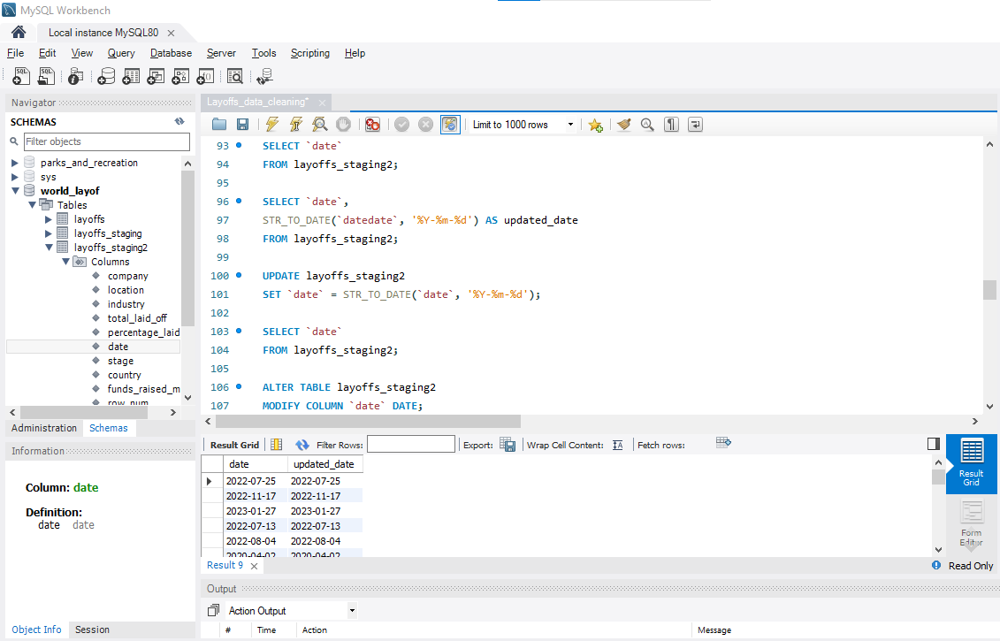

## 🧹 Data Cleaning Examples

During this project, I performed several data cleaning steps using SQL to prepare the dataset for further analysis.  
Below are some examples of the key cleaning tasks I worked on:

---

### 🕒 Date Format Cleaning
I converted the `date` column from text format to a proper SQL `DATE` type  
using the `STR_TO_DATE()` function.

```sql
UPDATE layoffs_staging2
SET `date` = STR_TO_DATE(`date`, '%m/%d/%Y');
This helped ensure all dates are in a consistent format and ready for time-based analysis.


🌍 Country Name Standardization

I noticed some inconsistencies in the country column (e.g., “United States.” vs “United States”).
To fix this, I used the TRIM() function to remove extra punctuation.

UPDATE layoffs_staging2
SET country = TRIM(TRAILING '.' FROM country);
This step standardized country names and eliminated duplicate variations


🧾 Removing Irrelevant Records

Some rows contained no useful data (both total_laid_off and percentage_laid_off were NULL).
These were removed to improve data quality.

DELETE FROM layoffs_staging2
WHERE total_laid_off IS NULL
AND percentage_laid_off IS NULL;


After this step, the dataset contained only meaningful and analyzable records.


### 🕒 Date Format Cleaning

In this step, I converted the `date` column from **text (VARCHAR)** to a proper **DATE** data type.  
Initially, the dates were stored as text in formats like `12/16/2022`, which made it difficult to perform  
any time-based analysis such as **trend tracking**, **time series analysis**, or **monthly aggregation**.  

By using the `STR_TO_DATE()` function, I transformed all values into a consistent SQL DATE format.  
This ensures that the dataset is ready for any future analysis that involves filtering or sorting by date.


